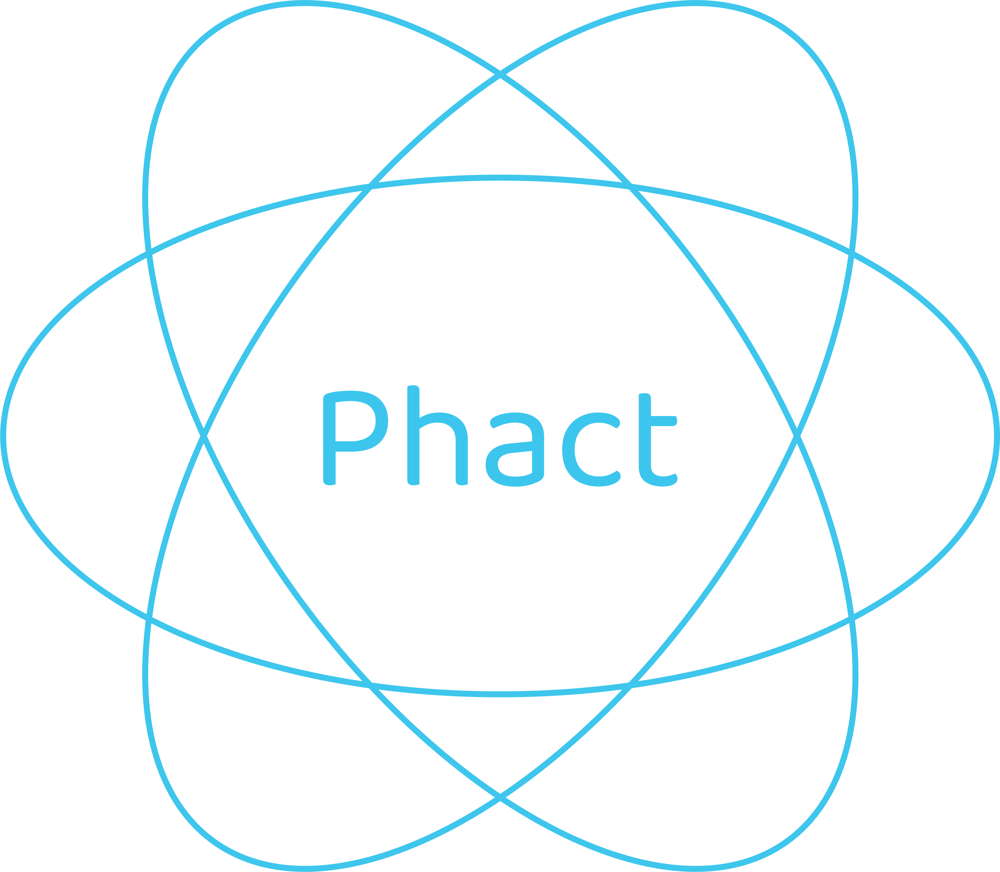

<div align="center">
      
  <h1>Phact</h1>
   <p>The framework for building server-rendered React applications.</p>
</div>

---
> [!CAUTION]
> This framework is still in development progress. DO NOT USE IT IN PRODUCTION.
---

## Installation
Install the Phact CLI globally using npm:

```bash
npm install -g @phact-org/phact-cli
```
---
## Quickstart
Follow these steps to get a new project up and running.

1. Create a New Project

   Run the following command in your terminal, replacing <project-name> with the desired name for your project.
   > phact create <project-name>
   
2. Build the Project

   Navigate into your project directory and run the build command.
   > phact build

   Alternatively, you can use the npm script:
   > npm run build

   This process creates a `dist` folder containing the rendered React pages with Phact placeholders and the necessary JavaScript bundles.


3. Prepare for Serving
   The `public` folder is the web server's entry point. To ensure your application runs correctly, you must copy the JavaScript bundles from the `dist` folder into the `public` folder.